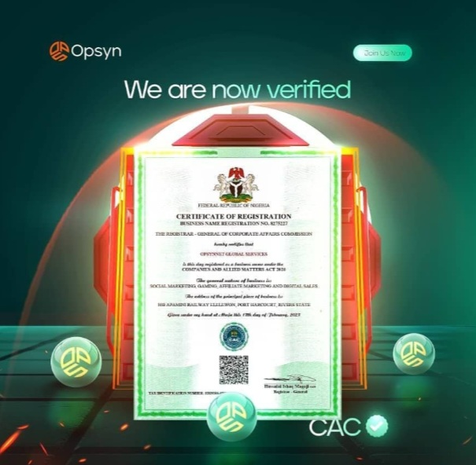

# WhatsApp Community Landing Page

A responsive landing page designed to promote and redirect users to a WhatsApp community group.



## 📋 Overview

This project is a clean, responsive landing page built with HTML, CSS, and JavaScript. It showcases the benefits of joining a WhatsApp community group and provides a seamless redirect to the group invitation link.

## ✨ Features

- **Responsive Design**: Fully responsive and optimized for all devices
- **Modern UI**: Clean, professional design with smooth animations
- **Mobile-Friendly Navigation**: Hamburger menu for smaller screens
- **Smooth Scrolling**: Enhanced user experience with smooth scrolling to page sections
- **WhatsApp Integration**: Direct link to WhatsApp group with confirmation dialog
- **SEO Friendly**: Semantic HTML structure for better search engine visibility

## 🚀 Main Sections

1. **Hero Section**: Eye-catching introduction with a call-to-action
2. **Features**: Key highlights of the community
3. **Benefits**: Detailed advantages of joining the community
4. **Join Now**: Direct WhatsApp group link with confirmation

## 🛠️ Technologies Used

- HTML5
- CSS3
- JavaScript (Vanilla)
- Font Awesome Icons

## 🖥️ Browser Compatibility

- Chrome (latest)
- Firefox (latest)
- Safari (latest)
- Edge (latest)
- Opera (latest)
- Mobile browsers

## 🔧 Setup & Installation

1. Clone the repository:
   ```bash
   git clone https://github.com/yourusername/whatsapp-community-landing.git
   ```

2. Navigate to the project directory:
   ```bash
   cd whatsapp-community-landing
   ```

3. Open `index.html` in your browser or use a local server:
   ```bash
   # Using Python
   python -m http.server
   
   # Using Node.js
   npx serve
   ```

## 📱 WhatsApp Group Configuration

To configure your own WhatsApp group:

1. Open the `index.html` file
2. Find the WhatsApp button link:
   ```html
   <a href="https://chat.whatsapp.com/YOUR_GROUP_CODE" id="whatsapp-button" class="whatsapp-button">
   ```
3. Replace `YOUR_GROUP_CODE` with your actual WhatsApp group invitation code

## 🎨 Customization

- **Colors**: Main color scheme is defined in the CSS file (primary: #25D366)
- **Images**: Replace images in the `Images` folder
- **Content**: Modify text in the HTML file to match your community's purpose

## 📄 License

This project is licensed under the MIT License - see the LICENSE file for details.

## 🙏 Acknowledgements

- Design with ❤️ byLUKE
- Font Awesome for icons
- WhatsApp for community features

---

## 📬 Contact

For any inquiries or support, please contact bylukeo@gmail.com
